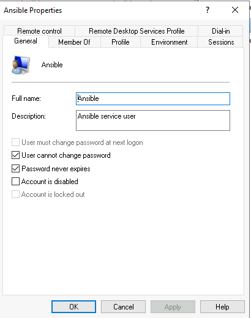

## Helper Functions

To set up the helper functions:
Substitute **{DEVOPS REPO_PATH}** with the path to your copy of the devops repo, e.g. `~/repos/internal/devops`
The below snippet will create a symlink (linux) to the helper functions, and refresh the current shell

```sh
mkdir -p ~/.bashrc.d
ln -sf {DEVOPS REPO PATH}/terraform/modules/apps/devops-server/config/functions/devops-linux-functions.sh ~/.bashrc.d/aex-devops-functions
source ~/.bashrc
```

## Working on Ansible

To edit the ansible scripts themselves, head to `aws-ansible` repo.
For every helper function you can specify the aws-ansible repo branch as the last parameter - this is for WIP testing.
Ordinarily leave off the last param to use the master branch - the latest stable version.

Example to call add-user for a specific aws-ansible branch:
`add-user aliciah dev_stage story/alicia/enhancing-user-prompt`

### Changing Requirements

**Note:** requirements.yaml changes are not auto-provisioned beyond pod startup.
So, changes to this must either:

* be done manually from inside the pod: `ansible-galaxy install -r /repos/aws-ansible/plays/roles/requirements.yml`
* or done by bouncing the pod

### Changing the inventory

Because the inventory is copied to en external folder; and also because the inventory will be deploy-specific, it is part of this docker file.
Meaning inventory changes require a new devops server.

### Setting up a managed Windows Server

Follow instructions [here](https://docs.ansible.com/ansible/latest/user_guide/windows_setup.html) to set up a new ansible host. The important bits:

* Run the WinRM installation [powershell script](https://docs.ansible.com/ansible/latest/user_guide/windows_setup.html#winrm-setup)
* To test, run this in powershell `winrm enumerate winrm/config/Listener`
* Create a new user _Ansible_, with the following properties, and a member of the _Administrators_ group. Note: all ansible users share the same password - get it from 1password **Windows Ansible User (devops-server)**



## A new version of this server

* Make you changes
* Update the `version` field in `helm/Chart.yaml`
* terraform apply from `deployments/operations/apps/devops-server`
