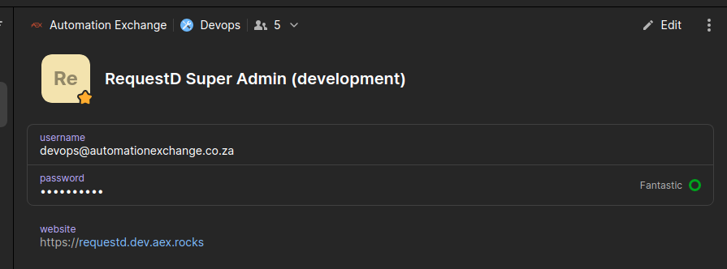
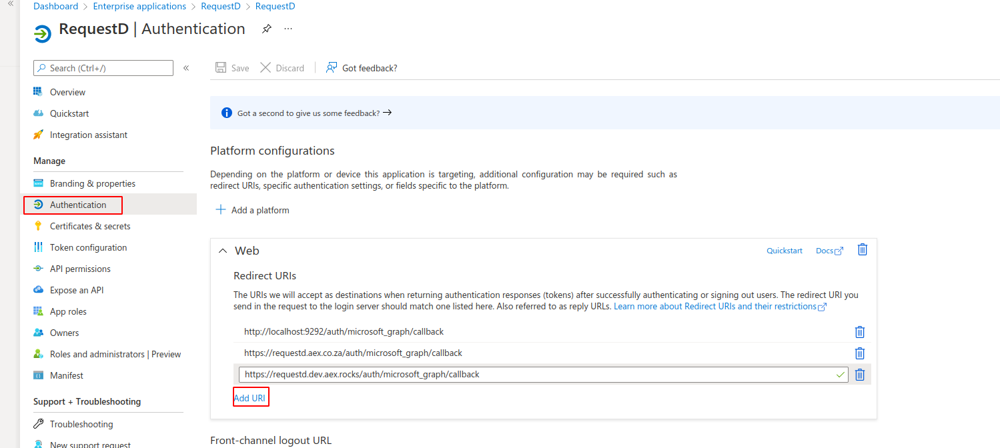

## When creating a new RequestD instance

Setup the super user login, using these creds from 1Password:

Proceed to Active Directory [Enterprise Applications | RequestD](https://aad.portal.azure.com/#blade/Microsoft_AAD_RegisteredApps/ApplicationMenuBlade/Authentication/appId/0a2a4b9b-9fbb-438f-9f3d-e242fca15b84)

And register the new Redirect URL as `https://{my new requestd domain}/auth/microsoft_graph/callback`

