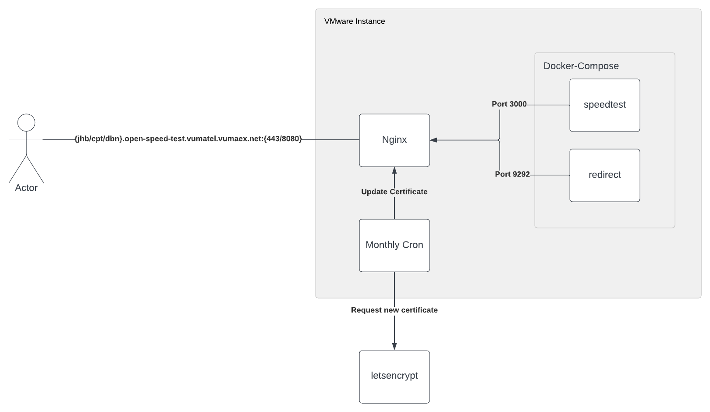

# Speedtest
## Setup
#
Each speedtest server consist of 3 components.

1. Nginx serving the speedtest site on port 443, redirect component on port 8080 as well as letsencrypt certificate requests on port 80. 
2. Docker-Compose running the speedtest and redirect applications.
3. Monthly cron use to request new ssl certificates from Letsencrypt.



## Installation
#
The following playbooks can be run to setup and update speedtest server instances.


### Fresh server
```
ansible-playbook setup-server.yml --ask-vault-pass --ask-become-pass
```

### Update compose file
```
ansible-playbook deploy.yml
```
### Update Nginx
```
ansible-playbook update-nginx.yml
```

All relevant credentials can be found in AWS secrets manager in the Vumatel Operations account.

# Monitoring
Currently there is only basic uptime monitors setup in Datadog that checks for SSL, speedtest run and redirection with alerts setup.

CPT: https://app.datadoghq.eu/synthetics/details/tq7-qit-8j8?from_ts=1677488235849&to_ts=1677491835849&live=true

JHB: https://app.datadoghq.eu/synthetics/details/xdp-ryz-7vf?from_ts=1677488235851&to_ts=1677491835851&live=true

DBN: https://app.datadoghq.eu/synthetics/details/c7n-7b3-3j6?from_ts=1677489638318&to_ts=1677493238318&live=true

## Operations
#
In the case that manual intervention is required on any instances SSH into the VM's using the devops ssh key with the vumateldevops user.

### Troubleshooting commands

#### SSL Issues
```
Verify certificate
openssl s_client -connect {IP/hostname}:{443/8080} -showcerts

To force request of new certificate run the following playbook

```
ansible-playbook rotate-certs.yml
```

Or run the following command

letsencrypt --renew-by-default certonly -n --webroot -w /var/www/letsencrypt -m devops@aex.co.za --agree-tos -d {{ domain_name }} --preferred-chain "ISRG Root X1" && service nginx reload    

```
#### Speedtest or redirect application issues
```
Check application 
cd into opt/speedtest
docker-compose logs -f

To restart applications

docker-compose down 
docker-compose up -d
```

#### Connectivity problems or Nginx issues
```
Check application
systemctl status nginx
tail -f /var/log/nginx/access.log

To restart Nginx
systemctl restart nginx
```

If server cannot not be reached raise with Vumatel networks team. 

## Possible future improvements
#
Add Nginx as part of the compose file, have run into problems with automatic ssl rotation 
with it. 

Server based monitoring